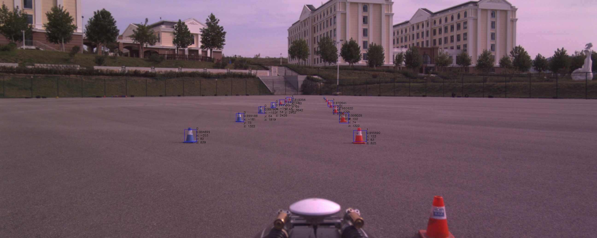
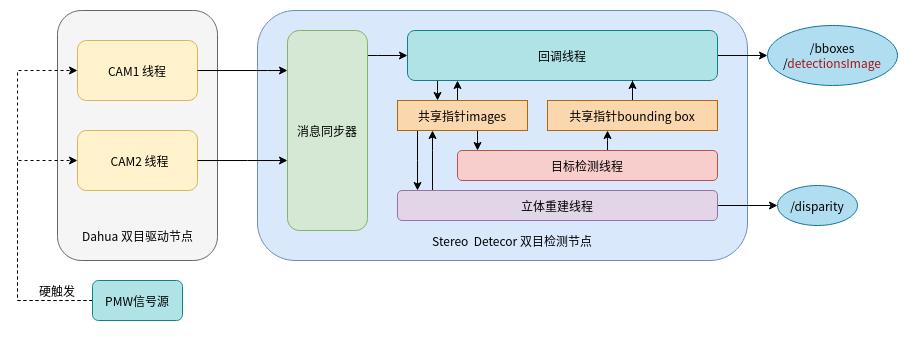

## Stereo Detector 



### hrt_20d 视觉系统



### 简介

hrt20d视觉系统 双目检测节点 ， 主要完成：
- 基于 yolov3 与 TensorRT 的 快速目标检测
- 基于 sgm 与 cuda 的 双目立体重建

### 依赖

- opencv > 3.2.0
- cuda == 10.1
- cudnn
- tensorrt >= 7

### 消息格式接口

#### 话题

|序号|话题名|消息格式|描述|订阅/发布|
|---|---|---|---|---|
| 1 | /camera/reactifyLeft | sensor_msgs/Image | 左相机矫正后图像 | 订阅 |
| 2 | /camera/reactifyRight | sensor_msgs/Image | 右相机矫正后图像 | 订阅 |
| 3 | /stereo_detector/detectionsImage | sensor_msgs/Image | 绘制上bboxes的图像 | 发布 |
| 4 | /stereo_detector/disparityImage | sensor_msgs/Image | 视差图 | 发布 |
| 5 | /stereo_detector/bboxes | stereo_detector/boundingboxes | 最终结果的bbox发布 | 发布 |

#### stereo_detector/boundingbox
```
int8 Class                  
float64 probability         
int64 xmin
int64 ymin
int64 xmax
int64 ymax
float64 worldX
float64 worldY
float64 worldZ
```
- Class: 类别；蓝０红１黄２
- probability: 类别的概率
- xmin,ymin,xmax,ymax : bbox 在图片上位置
- worldX，worldY，worldZ：物体中心点在相机坐标系下的位置

#### stereo_detector/boundingboxes
```
Header header
BoundingBox[] bounding_boxes
```
boundingbox数组

#### bounding box

### 运行节点

#### install libSGM
```
cd stereo_detector 
cd libSGM
mkdir build
cd build
cmake..
make
sudo make install 
```

#### 启动节点

```
cd ~/catkin_ws
catkin_make -DCATKIN_WHITELIST_PACKAGES=stereo_detector
source devel/setup.bash
roslaunch roslaunch stereo_detector stereo.launch 
```

#### launch 参数说明

```
<rosparam>
    yolo_width: 800                 
    yolo_height: 320
    yolo_classes: 3
    yolo_detection_threshold: 0.8
    yolo_nms_threshold: 0.05
    max_boxes: 200
    box_min_size_ratio: 0.012
    use_int8: false 
    image_width: 2592
    image_height: 1038
    disp_size: 64
    p1: 10
    p2_int: 220
    uniqueness: 0.99f
    subpixel: false
    num_paths: 8
    min_disp: 0
    lr_max_diff: 1
    baseline: 8.01614898702783f
    force: 1802.65855619198f
    cxl: 1299
    cyl: 424
</rosparam>
```

- yolo_width: yolov3 输入的宽度，适配使用的权重文件
- yolo_height: yolov3 输入的高度，适配使用的权重文件
- yolo_classes： yolov3 输出的类别数，适配使用的权重文件
- yolo_detection_threshold：yolov3 物体检测的阀值
- yolo_nms_threshold: nms 的阀值
- max_boxes: yolov3输出的最大bbox数
- use_int8: 使用int8做推断(TensorRT)
- image_width: sgm输入的图片宽度
- image_height：sgm输入的图片高度
- disp_size：sgm最大视差大小
- p1，p2_int： sgm做代价聚合的惩罚系数
- uniqueness： 唯一性约束
- num_paths：sgm 代价聚合的路径数
- min_disp：最小视差
- lr_max_diff：左右一致性
- baseline：基线长度
- force：左相机x方向上的焦距(fx)
- cxl：左图实际主点的x坐标
- cyl：左图实际主点的y坐标